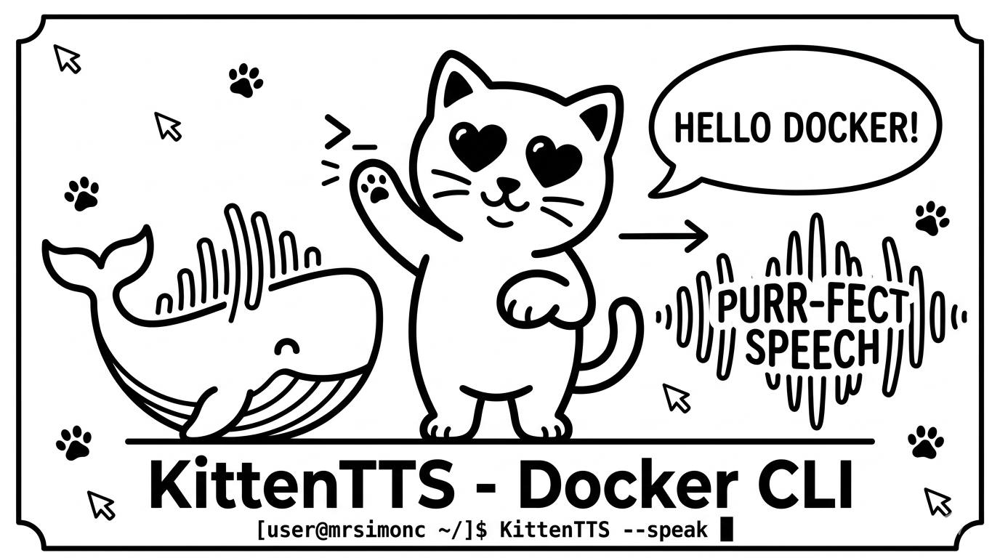

# KittenTTS LLM Skill + Docker Service



This repository is primarily a reusable `skills/kitten-tts` package for LLMs that want to speak short status updates aloud through a local KittenTTS Docker service.

Use it when you want an agent to finish work and say something like "Finished on SecondCopy: updated the README" without keeping the full TTS runtime installed on the host.

What this repo gives you:

- a persistent local Docker HTTP service for KittenTTS
- a reusable `skills/kitten-tts` folder you can copy into an LLM skill directory
- a bundled wrapper script at `skills/kitten-tts/scripts/kittentts_say.py`
- a simple direct-invocation path for testing the wrapper outside the skill system

The default baked model is `KittenML/kitten-tts-mini-0.8`.
The running container reads the baked model from the image itself, so changing `.env` only takes effect after a rebuild.

## Setup

### 1. Run the Docker service first

Start the local KittenTTS server:

```bash
docker compose up -d --build
```

Verify it is healthy:

```bash
curl http://127.0.0.1:59151/healthz
```

This builds the image with the default `kitten-tts-mini-0.8` model and starts a persistent container named `kittentts-http`.

### 2. Hook the skill into your LLM

Copy the included skill into whatever local skill directory your agent reads from:

```bash
mkdir -p ~/.agents/skills
cp -R ./skills/kitten-tts ~/.agents/skills/kitten-tts
```

Common locations include:

```text
~/.agents/skills/kitten-tts
~/.copilot/skills/kitten-tts
~/.claude/skills/kitten-tts
```

The skill tells the LLM to use the bundled wrapper script from the skill folder, default to `Bruno` unless another voice was requested, and prefer `--text` so the spoken message is preserved exactly.

Once installed, an LLM can run commands like:

```bash
./scripts/kittentts_say.py --voice Bruno --text "Hello, I am Bruno, your AI assistant. How can I help you today?"
```

If your agent requires an absolute path, point it at the copied skill directory's script.

### 3. Test the bundled script directly

You can also run the same bundled wrapper yourself without going through an LLM skill:

List voices:

```bash
python3 ./skills/kitten-tts/scripts/kittentts_say.py --list-voices
```

Speak custom text with a chosen voice:

```bash
python3 ./skills/kitten-tts/scripts/kittentts_say.py --voice Bella "Finished on one"
```

Print the generated URL without playing it:

```bash
python3 ./skills/kitten-tts/scripts/kittentts_say.py --voice Bruno --no-play --print-url "Finished on two"
```

Save the WAV to a chosen host path:

```bash
python3 ./skills/kitten-tts/scripts/kittentts_say.py --voice Luna --output ./finished.wav "Job completed"
```

Generate the file without playback and print the downloaded path:

```bash
python3 ./skills/kitten-tts/scripts/kittentts_say.py --no-play --print-path "Background task finished"
```

This wrapper talks to the Docker server over `http://127.0.0.1:59151`, downloads the generated WAV to a local temp file, and plays it with native host tooling. No host bind mount is required.

Useful options:

- `--voice <name>` chooses the voice
- `--list-voices` queries the server for available voices
- `--speed <value>` changes speech speed
- `--output <path>` saves the WAV to a specific host path
- `--no-play` generates the WAV without starting playback

## Supported Baked Models

See the upstream model repository for project details and model context: [KittenML/KittenTTS: State-of-the-art TTS model under 25MB 😻](https://github.com/KittenML/KittenTTS)

Set `KITTENTTS_MODEL` at build time to bake exactly one model into the image:

- `KittenML/kitten-tts-mini-0.8`
- `KittenML/kitten-tts-micro-0.8`
- `KittenML/kitten-tts-nano-0.8`
- `KittenML/kitten-tts-nano-0.8-int8`

The upstream project notes minor issues with the int8 nano model. Treat `KittenML/kitten-tts-nano-0.8-int8` as supported with caveats rather than the safest default.

## Rebuild with a different baked model

Option 1: use an environment variable for a one-off build.

```bash
KITTENTTS_MODEL=KittenML/kitten-tts-micro-0.8 docker compose up -d --build
```

Option 2: copy `.env.example` to `.env` and change `KITTENTTS_MODEL` before building.

```bash
cp .env.example .env
docker compose up -d --build
```

If you change `KITTENTTS_MODEL` later, rebuild the image again before restarting the container.

## Verify the server

List voices directly from the HTTP API:

```bash
curl http://127.0.0.1:59151/voices
```

Generate speech directly:

```bash
curl \
  -X POST http://127.0.0.1:59151/tts \
  -H "Content-Type: application/json" \
  -d '{"text":"Hello from KittenTTS Docker HTTP","voice":"Bruno","speed":1.0}'
```

That response includes metadata plus a `url` field that points to a downloadable WAV file under `/audio/...`.

## Operate the container

View logs:

```bash
docker compose logs -f
```

Restart:

```bash
docker compose restart
```

Stop:

```bash
docker compose stop
```

Remove the container:

```bash
docker compose down
```

Rebuild from scratch after changing models:

```bash
docker compose build --no-cache
docker compose up -d
```

## Notes

- The image pre-downloads the selected Hugging Face model during `docker build` so the container can start without fetching model files at runtime.
- The runtime is CPU-oriented by default.
- The server exposes lightweight JSON endpoints for health, voices, and synthesis metadata, plus WAV files under `/audio/...`.

## Default runtime contract

- Host port: `59151`
- Health endpoint: `http://127.0.0.1:59151/healthz`
- Voices endpoint: `http://127.0.0.1:59151/voices`
- Direct TTS endpoint: `http://127.0.0.1:59151/tts`
- Generated audio endpoint: `http://127.0.0.1:59151/audio/<id>.wav`
- Container behavior: `restart: unless-stopped`
